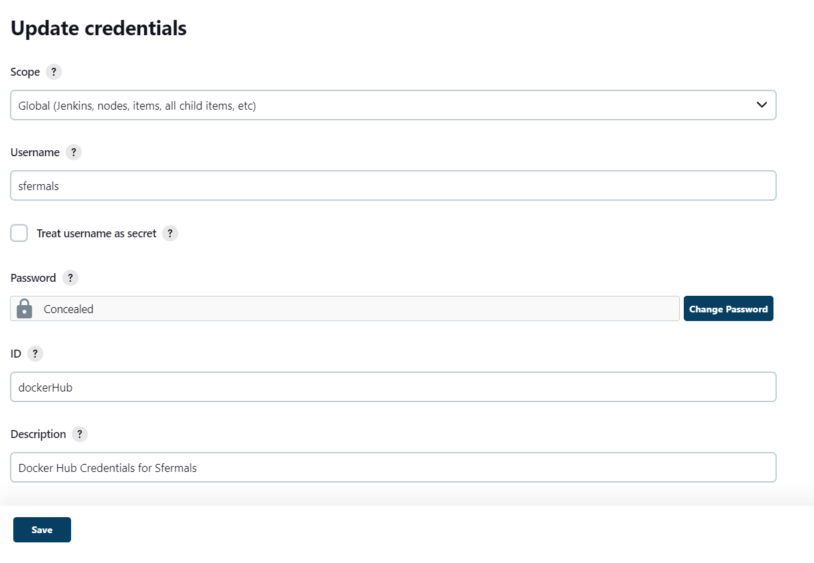

# 121TOOL_v1

TASK:

1)Create a Cl/CD pipeline (bash script or any CI/CD tool that you are most comfortable with) that monitors the "release" and "staging" branches of the repository.

The pipeline should be triggered on new commits and perform at least the following:

1. The pipeline should build and run tests on the application

2. Containerise and deploy the application on a public cloud instance

3. There are two branches, "staging" and 'release 

a. The "staging" branch should use "Questions-test.json as its input
datafile

b.The "release" branch should use "Questions.¡son" as its input datafile

4. Consider how versioning can be done to differentiate the builds If any of the tasks fails at any point, the pipeline should be stopped and an email
alert should be sent with relevant information.

_____________________________________________________________________________________________________

The Cl/CD pipeline will look as follows:

_____________________________________________________________________________________________________

Instructions on running the scripts for the task:

1) Fork this repository: git@github.com:Sfermals/121tool_v1.git and clone it locally. 

2) Configure credentials for docker in jenkins.

Dashboard >> Manage Jenkins >> Credentials >> System >> Global credentials (unrestricted) >> + Add Credentials

3) Configure multipipeline in jenkins

then save and it will detect our branches from github

4) Configure webhook

*github > (repo)Settings >Webhooks / Manage webhook

Payload URL: <jenkinsServerURL:PORT>/github-webhook/
Content type: application/json

so that commit will trigger thru webhook

5)Make necessary changes in Jenkinsfile as follows: 
* can use vs code 

save and commit changes.  

## Commit will trigger pipeline based on which branch..

As per requirenment, application makes use of a built-in JSON data file, whose filename can be
specified in the “DATA_FILE” environment variable. If the environment variable is not
found, then it will default to using “Questions.json”.

a. The “staging” branch should use “Questions-test.json” as its input
datafile

b. The “release” branch should use “Questions.json” as its input datafile

CI/CD ran in jenkins:

https://sfermals.app/

Improvement can be done: 

- fix trigger issue upon commiting
- run test intergrated with sonarqube to gather code vulnerability and code smells
- integrate into pipeline code, script to stop previously run container on same port before running new ones

exp: 

#!/usr/bin/env bash

for id in $(docker ps -q)
do
    if [[ $(docker port "${id}") == *"${1}"* ]]; then
        echo "stopping container ${id}"
        docker stop "${id}"
    fi
done

- To be continue as more and more experience and knowledge learned. Thanks.
